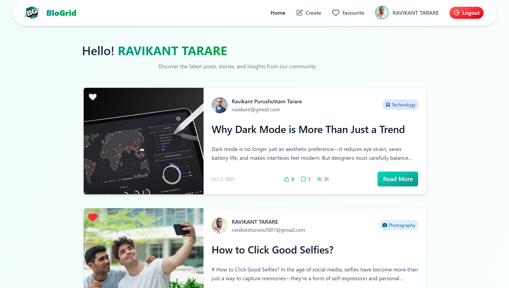

# [Blogrid](https://blogrid-ui.onrender.com)

BloGrid is a blogging app to share your stories, ideas, and experiences with the world.

> This may take 1-2 minutes to load on first render since I'm using free-plan of onrender to host our backend server. It goes to sleep after 15 minutes of inactivity.

Visit the [live demo](https://blogrid-ui.onrender.com) 👈🏻.

## Features

- User authentication & login with Google.
- Create, edit, and post blogs.
- Users can comment, like, and mark blogs as favourites.
- Image upload with drag & drop using imagekit.io.
- API caching for faster performance.
- Data encryption for security.
- Responsive design for mobile and desktop.

## Tech Stack

- **Frontend:** React, React Router, TailwindCSS, React Icons, Lucide React, React Hot Toast, Axios, Vite
- **Backend:** Node.js, Express, Mongoose, MongoDB, dotenv, CORS
- **Other:** Nodemon

## Contact

_For any inquiries or feedback, please contact:_

#### Ravikant Tarare

📩 [ravikanttarare2001@gmail.com](mailto:ravikanttarare2001@gmail.com)

📞 [+91-8275957698](tel:+918275957698)
